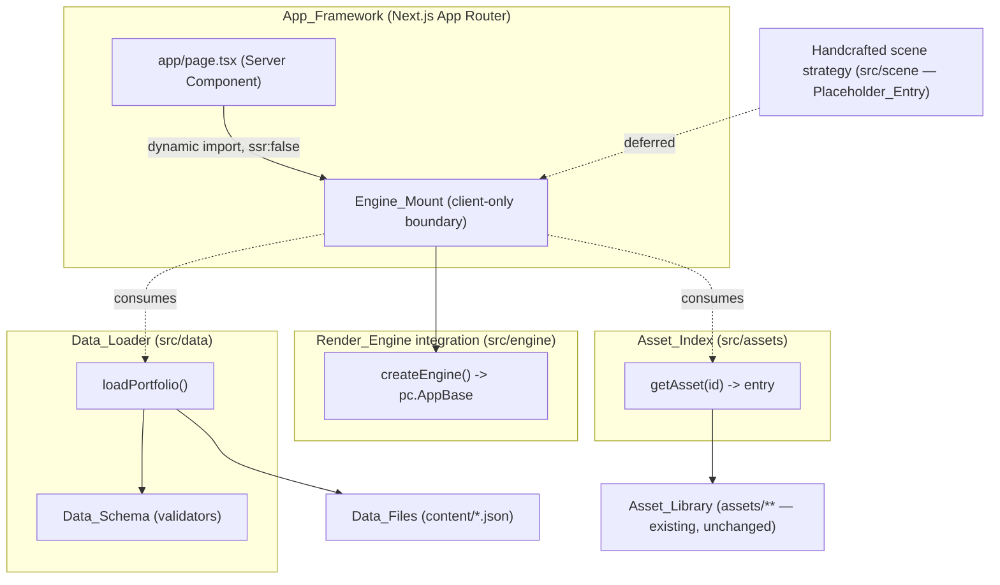

# Design Document

## Overview

The Portfolio World Engine foundation establishes a **reusable scaffold for a handcrafted 3D developer portfolio with data-driven content**. This spec delivers only the foundation: the folder structure, documentation set, data schema contract, data loading and validation logic, asset and scene organization strategies, the PlayCanvas + Next.js integration boundary, pinned dependency versions, and the governing architecture principles.

The central design idea is **separation of content from presentation**. The 3D world itself is **handcrafted**: scenes, terrain, the road, the river, the bridges, and checkpoint placement are manually authored, not procedurally or data-generated. Only the portfolio **content** — profile, projects, skills, experience, education, achievements, dialogue, settings, and socials — is driven by plain JSON `Data_Files`. A `Data_Loader` reads and validates that content against a documented `Data_Schema`, and the handcrafted scenes expose content slots that are populated from the loaded data. The `Render_Engine` (PlayCanvas Engine, the `playcanvas` npm package) is mounted exclusively through a client-only `Engine_Mount` boundary inside the Next.js App Router. Visual assets are referenced through stable logical identifiers resolved by a lightweight `Asset_Index` that maps only to files that already exist in the repository `assets/` folder.

**Procedural or data-driven generation of the world itself is explicitly NOT a goal of this engine and will NOT be attempted.** Data swaps change the content shown inside the handcrafted world; they do not generate or reshape the world geometry.

This produces an architecture where an `Adopter` swaps the `Data_Files` to populate the handcrafted world with their own portfolio content without touching engine code, and a `Contributor` can replace any single system (loader, asset index, engine integration) without disturbing the others.

### Scope Boundaries

In scope (this spec):
- Folder structure and per-folder purpose documentation
- Documentation set (README, principles, setup, contributor, roadmap, milestones)
- Data schema contract and one fictional `Demo_Developer` example per `Data_File`
- `Data_Loader` with schema validation and descriptive errors
- `Asset_Index` strategy and integrity rules
- Scene organization strategy for **handcrafted** scenes whose content slots are populated from `Data_Files` (conceptual, with construction marked as deferred)
- `Engine_Mount` minimal client-only integration that proves the boundary
- Version pinning, compatibility documentation, lockfile
- Coding standards, linter/formatter configuration
- Open-source license and extension-point documentation

Out of scope (later specs), recorded as `Placeholder_Entry` where a folder or doc references them:
- Gameplay scripting and runtime construction of the handcrafted world
- Asset placement and scene building
- Plugin system, multiple themes, AI-assisted authoring tooling

**Explicitly NOT a goal (now or later):** procedural or data-driven generation of the world itself. The world is authored by hand; `Data_Files` only supply the content displayed within it.

### Research Summary

Key findings that inform the design:

- **PlayCanvas Engine line.** The `playcanvas` npm package is on the 2.x major line (the MDN PlayCanvas engine guide was verified against 2.2 in November 2024, and the package has continued shipping 2.x releases through 2025). The engine is framework-agnostic and declares **no React peer dependency**, so React/Next.js compatibility is governed by the React–Next pairing, not by PlayCanvas. Source: [npm playcanvas versions](https://www.npmjs.com/package/playcanvas?activeTab=versions), [MDN: Building a basic demo with the PlayCanvas engine](https://developer.mozilla.org/en-US/docs/Games/Techniques/3D_on_the_web/Building_up_a_basic_demo_with_PlayCanvas/engine). PlayCanvas itself recommends pinning to a specific `2.x.y` version for deterministic production builds rather than using `@latest`. Source: [PlayCanvas Web Components: Getting Started](http://developer.playcanvas.com/user-manual/web-components/getting-started/).
- **Browser-only globals under SSR.** PlayCanvas requires `window`, `document`, and a WebGL context, which do not exist during server-side rendering. The established Next.js App Router pattern is to load the engine component with `next/dynamic` using `{ ssr: false }`, and to keep all engine code behind a `"use client"` boundary so the import never executes on the server. Source: [Next.js Lazy Loading guide](https://nextjs.org/docs/app/building-your-application/optimizing/lazy-loading), [Next.js SEO: Dynamic Import Components](https://nextjs.org/learn/seo/dynamic-import-components). The same "load the SDK only on the client" boundary pattern is the standard mitigation for browser-only SDKs in server-rendered frameworks. Source: [SignalWire: SSR & Next.js](https://signalwire.com/docs/browser-sdk/guides/ssr).
- **Asset library.** The existing `assets/` folder contains six Kenney packs (`character`, `Furniture`, `graveyard`, `nature_kit`, `prototypes`, `small-animals`). Model formats vary by pack: `character` and `graveyard` expose **GLB**; `nature_kit` exposes **GLTF** (plus FBX/OBJ/DAE/STL) but no GLB. This means the `Asset_Index` cannot assume a single format is present in every pack and must record the resolved format per entry.

Content from external sources above was rephrased for compliance with licensing restrictions.

## Architecture

### System Layers

The foundation is organized into four independently replaceable systems plus content and documentation, aligning each named system from the requirements to its own directory (Requirement 1.1, 1.5). The world geometry is handcrafted; these systems supply content, asset lookup, and the engine boundary that the authored scenes draw on.



The only path from `App_Framework` code to the `Render_Engine` is through the `Engine_Mount` (Requirement 7.1, 7.4). Server Components never import engine code.

### Folder Structure

The top-level structure separates application code, data, engine integration, the asset index, and documentation into distinct directories (Requirement 1.1). Each folder has a single documented purpose (Requirement 1.2). The existing `assets/` folder is preserved in place and only referenced, never relocated or duplicated (Requirement 1.3).

```
portfolio-world-engine/                 # Repository root
├─ app/                                 # App_Framework — Next.js App Router entry (routes, layout)
│  ├─ layout.tsx
│  ├─ page.tsx                          # Server Component; dynamically mounts the world
│  └─ globals.css
├─ src/
│  ├─ engine/                           # Render_Engine integration ONLY
│  │  ├─ EngineMount.tsx                # client-only React boundary ("use client")
│  │  ├─ createEngine.ts                # instantiates/disposes the pc.AppBase instance
│  │  └─ index.ts
│  ├─ data/                             # Data_Loader ONLY
│  │  ├─ schema/                        # Data_Schema validators (one per Data_File)
│  │  ├─ loader.ts                      # read + validate + expose
│  │  └─ index.ts
│  ├─ assets/                           # Asset_Index ONLY (logical id -> existing file)
│  │  ├─ index.ts                       # getAsset(id) lookup + integrity helper
│  │  ├─ assets.data.ts                 # the static id->file entry list
│  │  └─ types.ts
│  └─ scene/                            # Handcrafted scene organization strategy
│     └─ README.md                      # Placeholder_Entry: handcrafted construction deferred
├─ content/                            # Data_Files — the swappable portfolio content (JSON)
│  ├─ profile.json
│  ├─ projects.json
│  ├─ skills.json
│  ├─ experience.json
│  ├─ education.json
│  ├─ achievements.json
│  ├─ settings.json
│  └─ socials.json
├─ assets/                             # Asset_Library (EXISTING — unchanged, referenced only)
├─ docs/                               # Documentation set
│  ├─ SETUP.md                          # Setup_Guide
│  ├─ CONTRIBUTING.md                   # Contributor_Guide
│  ├─ ROADMAP.md                        # Roadmap_Doc
│  ├─ MILESTONES.md                     # development milestones
│  ├─ ARCHITECTURE.md                   # architecture + integration boundary + version compat
│  ├─ DATA_SCHEMA.md                    # the Data_Schema contract
│  ├─ ASSET_STRATEGY.md                 # asset organization + format preference
│  ├─ SCENE_STRATEGY.md                 # scene organization (conceptual)
│  └─ CODING_STANDARDS.md               # standards + naming conventions
├─ README.md                           # project purpose, stack, doc links
├─ PROJECT_PRINCIPLES.md               # Principles_Doc
├─ LICENSE                             # open-source license (MIT)
├─ package.json                        # Version_Manifest (pinned exact versions)
├─ package-lock.json                   # lockfile (resolved exact versions)
├─ tsconfig.json
├─ eslint.config.mjs                   # linter config
├─ .prettierrc                         # formatter config
├─ tailwind.config.ts
└─ next.config.mjs
```

Folders that hold a system implemented in a later spec (notably `src/scene/`) contain a `Placeholder_Entry` README documenting intended purpose (Requirement 1.4, 6.4).

### Data Flow

1. A Server Component (`app/page.tsx`) renders static page chrome and dynamically imports `Engine_Mount` with `ssr: false`.
2. On the client, `Engine_Mount` mounts, calls the `Data_Loader` to read and validate the `Data_Files`, and creates a `Render_Engine` instance via `createEngine()`.
3. The `Data_Loader` exposes validated, typed content. Visual references in the content are logical asset ids resolved by the `Asset_Index` to existing files.
4. On unmount, `Engine_Mount` disposes the engine instance and releases resources (Requirement 7.3).

## Components and Interfaces

### Engine_Mount (src/engine)

The client-only boundary that owns the engine lifecycle (Requirement 7.1–7.6).

- `EngineMount.tsx` begins with the `"use client"` directive and is imported by Server Components only through `next/dynamic(() => import(...), { ssr: false })`, guaranteeing it never runs during SSR (Requirement 7.2, 7.6).
- It renders a `<canvas>` element, creates the engine in a `useEffect` (which runs only on the client), and returns a cleanup function that disposes the engine (Requirement 7.3).
- It interacts with PlayCanvas only via `createEngine()`; `App_Framework` code never imports `playcanvas` directly (Requirement 7.4).

```typescript
// src/engine/createEngine.ts
import * as pc from "playcanvas";

export interface EngineHandle {
  app: pc.AppBase;
  dispose: () => void;
}

// Browser-only globals (window/document/WebGL) are touched ONLY inside this
// function, which is only ever called from a client-side useEffect.
export function createEngine(canvas: HTMLCanvasElement): EngineHandle {
  const app = new pc.Application(canvas, {});
  app.start();
  return {
    app,
    dispose: () => app.destroy(), // releases GPU/engine resources (Req 7.3)
  };
}
```

```typescript
// src/engine/EngineMount.tsx
"use client";
import { useEffect, useRef } from "react";
import { createEngine } from "./createEngine";

export function EngineMount() {
  const canvasRef = useRef<HTMLCanvasElement>(null);
  useEffect(() => {
    if (!canvasRef.current) return;
    const handle = createEngine(canvasRef.current);
    return () => handle.dispose(); // dispose on unmount (Req 7.3)
  }, []);
  return <canvas ref={canvasRef} />;
}
```

The minimal mount initializes an engine instance to prove the integration boundary, with no gameplay logic (Requirement 7.5).

### Data_Loader (src/data)

Reads, validates, and exposes the `Data_Files` (Requirement 4).

- `loadPortfolio()` reads each `Data_File`, validates it against its schema validator, and either returns a fully typed `Portfolio` object or a structured validation error.
- Validation is performed with a schema-definition library (Zod) so that required/optional status and types come directly from the `Data_Schema` definitions and stay in sync with the documented contract.

```typescript
// src/data/index.ts
export interface ValidationError {
  file: string;   // source Data_File name (Req 4.3, 4.4)
  field: string;  // offending/missing field path (Req 4.3, 4.4)
  kind: "missing_required" | "type_mismatch";
  message: string;
}

export type LoadResult =
  | { ok: true; portfolio: Portfolio }
  | { ok: false; errors: ValidationError[] };

export function loadPortfolio(files: RawDataFiles): LoadResult;
export function validateFile<T>(name: string, raw: unknown, schema: Schema<T>):
  | { ok: true; value: T }
  | { ok: false; errors: ValidationError[] };
```

The loader reads portfolio content exclusively from the `Data_Files`; no content is hardcoded in source (Requirement 4.1, 4.5). When a file conforms to the schema, the parsed content is exposed (Requirement 4.2). Missing required fields and type violations produce descriptive errors naming the field and source file (Requirement 4.3, 4.4).

### Asset_Index (src/assets)

A lightweight, static index that maps logical asset identifiers to existing files in the `Asset_Library` (Requirement 5). It is intentionally minimal: a flat list of entries plus a simple lookup and a simple integrity helper — no resolver hierarchy, caching layer, or runtime abstraction.

```typescript
// src/assets/types.ts
export type ModelFormat = "glb" | "gltf" | "fbx" | "obj";
export type AssetPack =
  | "character" | "Furniture" | "graveyard"
  | "nature_kit" | "prototypes" | "small-animals";

export interface AssetEntry {
  id: string;            // format-independent logical id (Req 5.5)
  pack: AssetPack;       // one of the existing packs (Req 5.2)
  path: string;          // path under assets/ to an EXISTING file (Req 5.1)
  format: ModelFormat;   // resolved format for this entry (Req 5.4)
  label?: string;        // optional human-readable name
  category?: string;     // optional grouping (e.g. "character", "prop", "nature")
}

export interface AssetPlaceholder {
  id: string;
  placeholder: true;     // Placeholder_Entry for a needed-but-missing asset (Req 5.3)
  description: string;
}
```

```typescript
// src/assets/index.ts
// Simple lookup over the static list. References are always logical ids, not paths.
export function getAsset(id: string): AssetEntry | AssetPlaceholder;

// Simple integrity helper used by tests/tooling: returns ids whose target file
// is not present in the provided set of known library files.
export function findBrokenEntries(
  entries: AssetEntry[],
  knownFiles: Set<string>,
): string[];
```

Identifiers are independent of file format, so the backing file can be swapped without changing the id used by other systems (Requirement 5.5). The index references only the six existing packs (Requirement 5.2). When a needed asset does not exist, an `AssetPlaceholder` is recorded instead of a path to a non-existent file (Requirement 5.3). Entries always map to files that already exist in the `Asset_Library` (Requirement 5.1).

### App_Framework boundary (app/)

```typescript
// app/page.tsx (Server Component)
import dynamic from "next/dynamic";

const EngineMount = dynamic(
  () => import("../src/engine/EngineMount").then((m) => m.EngineMount),
  { ssr: false }, // engine never imported/executed on the server (Req 7.2, 7.6)
);

export default function Page() {
  return <main><EngineMount /></main>;
}
```

## Data Models

### Asset format preference

When multiple model formats exist for one asset, the preferred order for the `Render_Engine` is **GLB → GLTF → FBX → OBJ** (Requirement 5.4). PlayCanvas loads glTF/GLB natively, so a binary `.glb` is preferred where present (e.g., `character`, `graveyard`). Packs that ship only `.gltf` (e.g., `nature_kit`) resolve to `gltf`. The resolved format is recorded per entry rather than assumed globally, because format availability varies by pack.

### Asset_Index mapping (example, references existing files only)

```typescript
// src/assets/assets.data.ts
export const ASSET_INDEX: AssetEntry[] = [
  { id: "character.male.a", pack: "character", format: "glb", category: "character",
    label: "Male character A",
    path: "assets/character/Models/GLB format/character-male-a.glb" },
  { id: "character.female.a", pack: "character", format: "glb", category: "character",
    label: "Female character A",
    path: "assets/character/Models/GLB format/character-female-a.glb" },
  // nature_kit ships GLTF (no GLB) — format resolved accordingly
  // { id: "nature.tree.oak", pack: "nature_kit", format: "gltf", category: "nature", path: "assets/nature_kit/Models/GLTF format/..." },
];

export const ASSET_PLACEHOLDERS: AssetPlaceholder[] = [
  { id: "world.bridge.main", placeholder: true,
    description: "Bridge model representing progression between checkpoints; no matching asset confirmed in the library yet." },
];
```

### Data_Schema (content, not presentation)

Every field describes content independent of any engine, layout, or asset (Requirement 3.5). Where a field references a visual asset, it stores a logical `Asset_Index` id, never a file path (Requirement 3.6). All example instances use fictional `Demo_Developer` content only (Requirement 3.3, 3.4).

`profile.json` answers the six world-checkpoint questions (Requirement 3.2):

| Field | Type | Required | Checkpoint question |
|---|---|---|---|
| `name` | string | yes | Who am I? |
| `title` | string | yes | Who am I? |
| `tagline` | string | yes | Who am I? |
| `bio` | string | yes | Who am I? |
| `avatarAssetId` | string (asset id) | no | Who am I? |
| `knowledgeSummary` | string | yes | What do I know? |
| `workSummary` | string | yes | What have I built? |
| `thinkingApproach` | string | yes | How do I think? |
| `futureDirection` | string | yes | What am I building next? |
| `collaborationValue` | string | yes | Why work with me? |

`projects.json` — array of:

| Field | Type | Required |
|---|---|---|
| `id` | string | yes |
| `name` | string | yes |
| `description` | string | yes |
| `techStack` | string[] | yes |
| `role` | string | no |
| `url` | string | no |
| `repoUrl` | string | no |
| `highlights` | string[] | no |
| `assetId` | string (asset id) | no |

`skills.json` — array of: `{ id: string (req), name: string (req), category: string (req), proficiency: number 1–5 (req), years: number (opt) }`.

`experience.json` — array of: `{ id (req), company (req), role (req), startDate (req, ISO), endDate (string|null, req), summary (req), highlights: string[] (opt) }`.

`education.json` — array of: `{ id (req), institution (req), credential (req), field (opt), startDate (req), endDate (string|null, req) }`.

`achievements.json` — array of: `{ id (req), title (req), description (req), date (opt), url (opt) }`.

`socials.json` — array of: `{ platform (req), label (req), url (req) }`.

`settings.json` — object: `{ theme (req), worldTitle (req), defaultCharacterAssetId (opt, asset id), locale (opt) }`.

```typescript
// src/data/schema (shape summary)
export interface Portfolio {
  profile: Profile;
  projects: Project[];
  skills: Skill[];
  experience: Experience[];
  education: Education[];
  achievements: Achievement[];
  settings: Settings;
  socials: Social[];
}
```

### Scene organization (handcrafted — construction deferred)

The scene strategy names six **handcrafted** checkpoints, one per developer question. Each authored scene exposes content slots that are populated from the `Data_Files`; the geometry, terrain, and layout of every scene are manually authored rather than generated (Requirement 6.1, 6.2):

| Checkpoint | Question | Primary content source |
|---|---|---|
| Origin | Who am I? | `profile.json` |
| Library | What do I know? | `skills.json` |
| Workshop | What have I built? | `projects.json` |
| Observatory | How do I think? | `profile.thinkingApproach`, `experience.json` |
| Horizon | What am I building next? | `profile.futureDirection`, `roadmap` |
| Gateway | Why work with me? | `profile.collaborationValue`, `socials.json` |

The guiding world elements are handcrafted and map conceptually: a **single road** sequences the checkpoints, a **winding river** separates thematic areas, and **bridges** mark progression between them (Requirement 6.3). All runtime construction of the handcrafted world is marked as a `Placeholder_Entry` deferred to a later spec (Requirement 6.4). Data swaps change only the content shown at each checkpoint, never the authored layout.

## Performance Budget

Performance is a first-class goal (aligned with Principle 9.3, performance over visual effects). The handcrafted world is authored to stay within these targets:

- **60 FPS** on typical consumer hardware as the frame-rate target.
- **Lazy loading** of heavy assets and engine code — the `Render_Engine` is already dynamically imported (`ssr: false`), and large models/textures load on demand rather than upfront.
- **Texture compression** for shipped textures to reduce GPU memory and download size.
- **Optimized, minimal asset usage** — prefer reusing indexed assets and the lightest adequate model format (GLB where available) over adding new or oversized assets.

This section states goals only; concrete profiling, budgets per scene, and tooning are handled in later implementation specs.

## Future Placeholders (deferred — not implemented in this foundation)

The following systems are explicitly recorded as `Placeholder_Entry` items and are **not** implemented in this spec; each is deferred to a later spec:

- **Audio (`Placeholder_Entry`).** Ambient sound, music, and interaction audio cues. Deferred.
- **Camera behavior (`Placeholder_Entry`).** Follow/framing logic, transitions between checkpoints, and cinematic moments. Deferred.
- **Checkpoint save/resume (`Placeholder_Entry`).** Persisting visitor progress and resuming at the last reached checkpoint. Deferred.

These placeholders define intent only so future specs have a documented home; no behavior is built now.

## Milestones and Vertical Slice

Development milestones are documented in `docs/MILESTONES.md`. The culminating milestone of the foundation track is the **Vertical Slice** — a playable, handcrafted prototype that exercises the foundation end to end. The architecture and scope above are designed to support this handcrafted vertical slice as the final deliverable, which includes:

- player spawn,
- camera,
- movement,
- terrain,
- road,
- river,
- bridge,
- the first checkpoint, and
- basic dialogue (content sourced from `Data_Files`).

The Vertical Slice proves the handcrafted-world approach with data-driven content populating authored scenes, while audio, full camera behavior, and checkpoint save/resume remain deferred placeholders.

## Correctness Properties

*A property is a characteristic or behavior that should hold true across all valid executions of a system — essentially, a formal statement about what the system should do. Properties serve as the bridge between human-readable specifications and machine-verifiable correctness guarantees.*

The foundation's pure logic — schema validation, the data loader, and the asset index — is well suited to property-based testing. The PlayCanvas/Next.js integration, documentation, configuration, and version pinning are not property-testable (they are verified by smoke, example, and integration tests described in the Testing Strategy). The properties below were derived from the prework analysis, with redundant criteria consolidated.

### Property 1: Schema-conforming data round-trips through the loader

*For any* dataset generated to conform to the `Data_Schema`, serializing it to JSON and loading it through the `Data_Loader` SHALL succeed and expose parsed content equal to the original dataset (`load(serialize(x)) == x`).

**Validates: Requirements 3.1, 3.3, 4.2, 12.1**

### Property 2: Any single schema violation produces a descriptive, located error

*For any* schema-conforming dataset with exactly one mutation applied — either removing a required field or replacing a field's value with one of the wrong type — the `Data_Loader` SHALL fail validation and return a descriptive error whose contents name both the offending field and the source `Data_File`.

**Validates: Requirements 4.3, 4.4**

### Property 3: Asset references are logical identifiers, never file paths

*For any* schema-conforming content instance, every value occupying an asset-reference field (e.g. `avatarAssetId`, `assetId`, `defaultCharacterAssetId`) SHALL be a logical `Asset_Index` identifier that either resolves through the index or is a known `Placeholder_Entry`, and SHALL never be a filesystem path into the `assets/` folder.

**Validates: Requirements 3.6**

### Property 4: Asset index integrity

*For any* set of `Asset_Index` entries and any set of known `Asset_Library` files, the integrity check SHALL report a non-placeholder entry as broken if and only if its mapped file is absent from the known files or its pack is not one of the six allowed packs (`character`, `Furniture`, `graveyard`, `nature_kit`, `prototypes`, `small-animals`); needed-but-missing assets SHALL appear only as `Placeholder_Entry` records and never as path-bearing entries.

**Validates: Requirements 5.1, 5.2, 5.3**

### Property 5: Asset identifiers are independent of file format

*For any* `Asset_Index` entry, replacing its backing file with another valid format for the same logical asset (changing `format` and `path`) SHALL leave the entry's `id` unchanged and the asset SHALL remain resolvable by that same `id`.

**Validates: Requirements 5.5**

## Error Handling

- **Validation errors (Data_Loader).** Validation never throws for malformed content. `loadPortfolio` / `validateFile` return a structured `LoadResult` with an `errors` array; each `ValidationError` carries `file`, `field`, `kind`, and a human-readable `message` (Requirement 4.3, 4.4). The loader aggregates all violations in a file rather than failing on the first, so an `Adopter` sees every problem at once.
- **Missing files.** If a required `Data_File` is absent, the loader returns a `missing_required` error naming the file, treated the same as a missing required field at the document root.
- **Asset index resolution.** `getAsset(id)` returns either a resolved `AssetEntry` or an `AssetPlaceholder`; it never returns a path to a non-existent file (Requirement 5.3). Unknown ids surface as a placeholder-style "unresolved id" result so callers can render a fallback.
- **Engine lifecycle.** `createEngine` is only ever invoked from a client-side `useEffect`. `Engine_Mount` guards on canvas availability and always disposes the engine in its cleanup function, even if a later initialization step fails, preventing leaked WebGL contexts (Requirement 7.3).
- **SSR safety.** Because the engine module is imported only via `dynamic(..., { ssr: false })` behind a `"use client"` boundary, browser-only globals are never referenced during server rendering; a production build therefore completes without server-side reference errors (Requirement 7.2, 7.6).

## Testing Strategy

A dual approach is used: property-based tests for the pure logic, and example/smoke/integration tests for structure, configuration, and external tooling.

### Property-Based Tests

- Library: **fast-check** with the existing JS/TS test runner (Vitest).
- Each property test runs a **minimum of 100 iterations**.
- Each test is tagged with a comment in the form:
  `// Feature: portfolio-world-engine, Property {number}: {property_text}`
- Each correctness property (P1–P5) is implemented by a **single** property-based test:
  - P1 — schema-aligned generators produce conforming datasets; assert `load(serialize(x))` equals `x`.
  - P2 — generate a conforming dataset, apply one mutation (drop a random required field or wrong-type a random field), assert failure and that the error names the field and file.
  - P3 — generate content; assert every asset-reference field is an `Asset_Index` id / known placeholder, not a path.
  - P4 — generate `Asset_Index` entries and known-file sets; assert `findBrokenEntries` matches the precise broken-iff condition; placeholders never carry paths.
  - P5 — generate an entry and an alternate valid format; assert id stability and continued resolvability.

### Example and Edge-Case Unit Tests

- Folder structure: required directories exist and each named system has its own directory (Req 1.x).
- `profile.json` schema includes the six required checkpoint fields (Req 3.2).
- Every shipped `Demo_Developer` example file validates against its schema (Req 3.3, exercised by P1 generators plus a fixture test).
- Engine lifecycle: mount then unmount calls `dispose`/`destroy` (Req 7.3) using a mocked canvas/WebGL; minimal mount creates an instance (Req 7.5).
- Import-boundary checks: only `src/engine` imports `playcanvas`; `App_Framework` reaches the engine only through `Engine_Mount` (Req 7.1, 7.4, 12.5).

### Smoke Tests

- Documentation set exists with required references and placeholders (Req 2.x, 6.x).
- `PROJECT_PRINCIPLES.md` states each of the seven principles (Req 9.1–9.7).
- `package.json` pins exact versions (no range prefixes) for Next.js, React, TypeScript, TailwindCSS, and `playcanvas`; lockfile present (Req 8.1, 8.2).
- Linter and formatter configs present (Req 10.3); `LICENSE` present at root (Req 12.2).

### Integration Tests (external tooling, 1–3 runs each)

- Dependency install completes without unresolved peer conflicts among Next.js, React, and PlayCanvas (Req 8.4).
- Production build (`next build`) completes without dependency-mismatch or SSR reference errors (Req 8.5, 7.6).
- Linter run reports zero violations (Req 10.4).
- Dev server starts from a clean checkout and the client-side `Engine_Mount` initializes an engine instance on load (Req 11.2, 11.3).

### Version Pinning and Compatibility (design decision)

The `Version_Manifest` pins exact versions for the App_Framework, React, TypeScript, TailwindCSS, and the Render_Engine (Requirement 8.1). The chosen compatible set, to be recorded with its confirming source in `docs/ARCHITECTURE.md` (Requirement 8.3):

- **Next.js** 14.2.x (App Router, stable, pairs with React 18)
- **React / React DOM** 18.3.x
- **TypeScript** 5.4.x
- **TailwindCSS** 3.4.x
- **playcanvas** 2.x (pinned to an exact `2.x.y` patch at scaffold time; PlayCanvas recommends pinning an exact `2.x.y` for deterministic production builds)

Rationale: PlayCanvas Engine declares no React peer dependency, so React/Next compatibility is independent of the engine; Next.js 14.2 + React 18.3 is a widely deployed, stable pairing. The exact `playcanvas` patch is pinned and verified against this set during scaffolding. **If a documented compatible version set cannot be confirmed for the chosen `playcanvas` patch against Next.js 14.2, a `Placeholder_Entry` describing the unresolved compatibility risk is recorded in `docs/ARCHITECTURE.md`** (Requirement 8.6).
